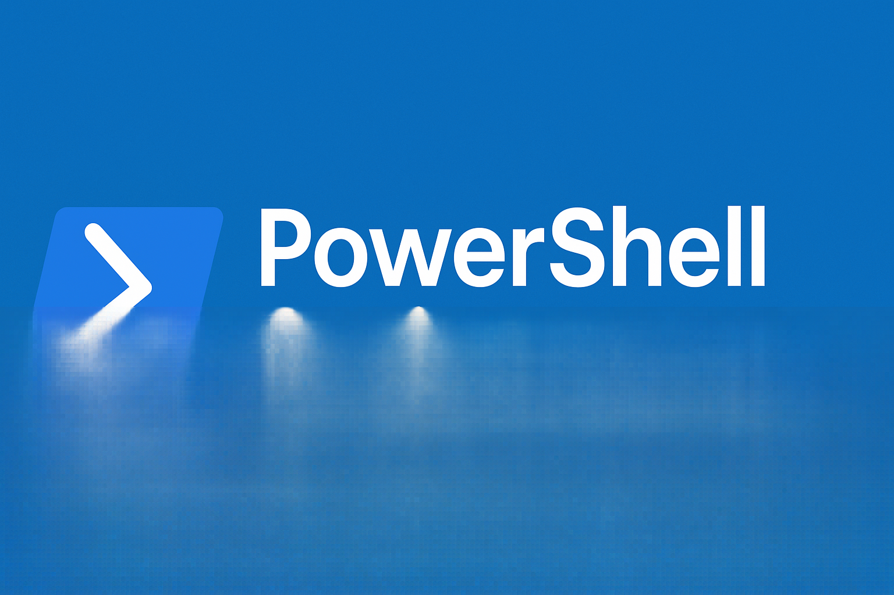

<p align="center">
  
</p>

# PowerShell Scripts ✨  

  
  
  
  
  

Welcome to my collection of **PowerShell scripts** 🚀  

This repository is where I keep the scripts I write, tweak, and experiment with. Some of them solve small everyday problems, others are automation tools I actually use in real workflows. I built this repo as both a personal toolbox and a place to share with others who might find these scripts useful.  

---

## 💡 Why I Made This
- To automate the boring stuff and save time ⏳  
- To learn and sharpen my PowerShell skills 🔧  
- To have a central hub for scripts I can reuse anywhere 🌍  
- To share snippets, tips, and ready-to-use scripts with anyone interested 🤝  

---

## 📂 Repository Structure
```
📁 Scripts/
   ├── System/
   ├── ActiveDirectory/
   ├── Network/
   ├── Productivity/
   └── Fun/
  
README.md
LICENSE
```
*(Structure may evolve as I keep adding more scripts!)*  

---

## 🌟 Featured Scripts
Here are some of the most useful scripts you’ll find in this repo:  

- **System/Clean-TempFiles.ps1** → Cleans up temporary files and frees disk space 🧹  
- **System/Get-SystemInfo.ps1** → Quick overview of CPU, RAM, OS, and disk info 💻  
- **Network/Test-Network.ps1** → Ping multiple hosts and test connectivity 🌐  
- **Productivity/Start-Timer.ps1** → A simple timer to boost focus ⏱️  
- **Fun/Quote-Of-The-Day.ps1** → Display a random motivational quote ✨  

*(More scripts coming soon…)*  

---

## ⚙️ Requirements
- Windows PowerShell 5.1 **or** PowerShell 7+  
- Basic understanding of how to run `.ps1` files  
- Execution Policy set properly (you may need to run:  
  ```powershell
  Set-ExecutionPolicy RemoteSigned -Scope CurrentUser
  ```  
)  

---

## 🚀 How to Use
1. Clone this repo:  
   ```powershell
   git clone https://github.com/p-prabu/powershell.git
   ```
2. Navigate to the script folder:  
   ```powershell
   cd .\Scripts\System\
   ```
3. Run a script:  
   ```powershell
   .\MyScript.ps1
   ```  

---

## 🧑‍💻 About Me
Hi, I’m **Prabu** 👋  

I believe in **learning by doing**. PowerShell has been my way of automating little things, experimenting with system tweaks, and building reusable tools.  

I enjoy:  
- Writing clean, reusable scripts  
- Simplifying repetitive tasks  
- Documenting my journey so others can learn from it  

---

## 🤝 Contributing
This is a personal repo, but if you stumble upon it and want to suggest improvements, fixes, or even new script ideas—feel free to open an **issue** or submit a **pull request**.  

---

## 📜 License
This project is licensed under the MIT License – feel free to use, modify, and share!  

---

✨ Thanks for stopping by! Hopefully, these scripts save you time or spark an idea for your own automation journey.  
